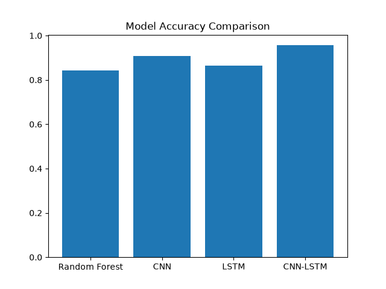
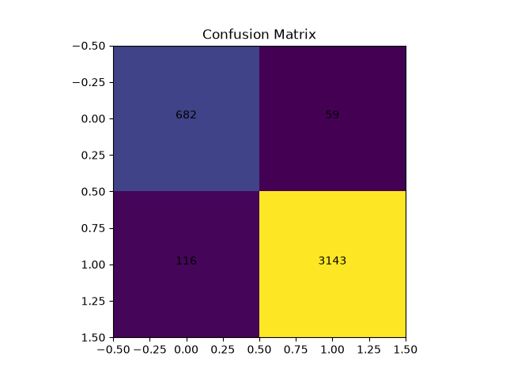
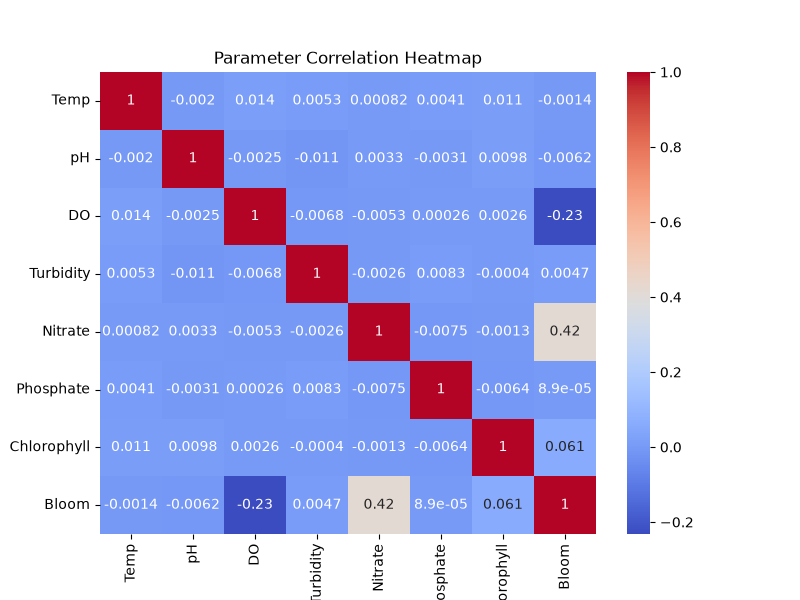
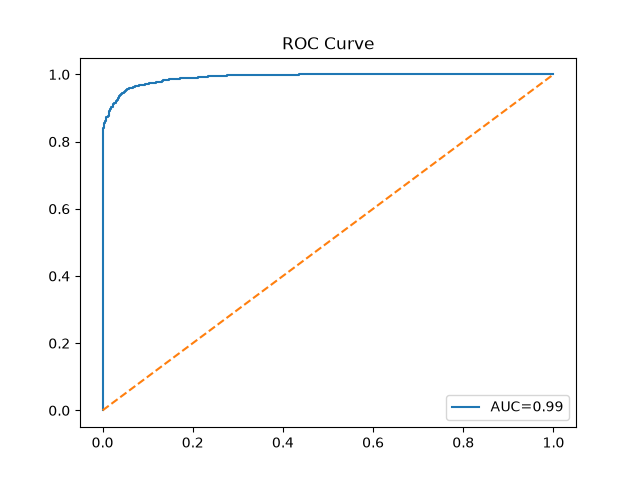

# 🌊 A Hybrid CNN-LSTM Framework for Algal Bloom Detection in Water Quality Management

## 📌 Overview
This project presents a Hybrid CNN-LSTM Deep Learning model for detecting algal blooms using water quality parameters. The system predicts whether water is safe or unsafe based on environmental conditions.

---
## Project Output



## 🚀 Features

- Hybrid CNN-LSTM Deep Learning Model
- Random Forest, CNN and LSTM Comparison
- Water Quality Prediction
- Correlation Heatmap
- Confusion Matrix
- ROC Curve
- Accuracy Comparison
- Manual Water Parameter Prediction

---

## 🛠 Technologies Used

- Python
- TensorFlow
- Keras
- NumPy
- Pandas
- Matplotlib
- Scikit-learn

---

## 📊 Water Quality Parameters

- Temperature
- pH
- Dissolved Oxygen
- Turbidity
- Nitrate
- Phosphate
- Chlorophyll

---

## 📈 Results

The Hybrid CNN-LSTM model achieved the highest prediction accuracy compared with Random Forest, CNN, and LSTM models.

### Accuracy Comparison


### Confusion Matrix



### Correlation Heatmap



### ROC Curve



---

## 📂 Project Structure

```
Hybrid-CNN-LSTM-Algal-Bloom-Detection
│
├── main_timeseries.py
├── generate_timeseries_dataset.py
├── requirements.txt
├── algal_bloom_timeseries_dataset.csv
├── README.md
└── images
    ├── accuracy.png
    ├── confusion.png
    ├── heatmap.png
    └── roc.png
```

---

## ▶️ How to Run

```bash
pip install -r requirements.txt
python generate_timeseries_dataset.py
python main_timeseries.py
```

---


## 👨‍💻 Author

**Badavath Dinesh Naik**

GitHub: https://github.com/Dinesh6996
